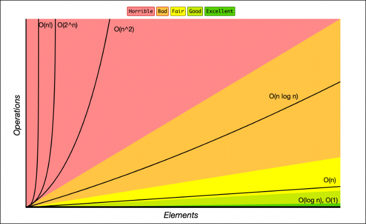

<<<<<<< HEAD
# Informe Técnico: Sistema de Registro de Avistamiento de Aves (BirdWatch) 🐦

## 1. Introducción
El presente documento describe el desarrollo de una aplicación web para el registro de avistamientos de aves, diseñado como proyecto final de la asignatura de Estructuras de Datos. El sistema permite ingresar, visualizar y ordenar registros usando estructuras como listas, colas y árboles binarios.
=======
# Informe Técnico: Sistema de Registro de Avistamiento de Aves

## 1. Introducción
El presente documento describe el desarrollo de un sistema web para el registro de avistamientos de aves, diseñado como proyecto final de la asignatura de Estructuras de Datos. El sistema permite ingresar, visualizar y ordenar registros usando estructuras como listas, colas y árboles binarios.
>>>>>>> 4b557eb0cd5d7953a101b4246388ef91111b3bb3

## 2. Objetivos
- Aplicar estructuras de datos para resolver un problema real.
- Implementar una aplicación web funcional con Flask.
<<<<<<< HEAD
- Facilitar registro datos de avistamiento.

## 3. Definicion del problema
En la actualidad colombia se encuentra posicionada como el pais con mayor registro por especies avistadas en el mundo, esto de acuerdo con los datos mas recientes tomados por la aplicacion de Cornell University *Merlin*, el pasado *Global Big Date* (10/05/25).
La observación de aves es una actividad científica y recreativa que genera datos valiosos para estudios ecológicos, los cuales permiten reconocer la biodiversidad que existente en lugar especifico, haciendo un ejercicio de apropiacion territorial. Este sistema busca facilitar el registro y consulta de dichos datos los cuales pueden ser de interes para la toma de decisiones en los proyectos de "desarrollo" urbano, como en el caso de la ALO-Sur.

## 4. Justificación de las estructuras de Datos Usadas

El proyecto utiliza Tipos Abstractos de Datos (TAD) para organizar la informacion de manera que el diseño de la aplicacion resulte mas comodo en su implementación y sea mas practica la reutilización de codigo.Dentro de los TAD encontramos estructuras como las pilas, colas, listas arboles entre otros.
En el proyecto se utilizaron las siguientes estructuras de datos:
listas dinámicas (para almacenar los avistamientos), colas (para registrar los avistamientos en orden de ingreso) y árboles binarios para almacenar de manera jerarquica y alfabética los avistamientos.

- **Listas dinámicas:** Almacenan todos los registros de avistamientos.
- **Colas (deque):** Mantienen los últimos 10 registros de avistamientos.
- **Árbol Binario de Búsqueda (BST):** Clasifica avistamientos por especie.

## 5. Algoritmos Implementados

Para reakizar una correcta gestion de los datos registrados en el sitio se recurre a logica algoritmica para ordenar los datos de acuerdo con un parametro especifico, como, la fecha, la especie o el lugar de avistamiento. Los algoritmos implementados para tal fin son:

=======
- Facilitar el análisis y visualización de datos de avistamiento.

## 3. Justificación del Problema
La observación de aves es una actividad científica y recreativa que genera datos valiosos para estudios ecológicos. Este sistema busca facilitar el registro y consulta de dichos datos.

## 4. Estructuras de Datos Usadas
- **Listas dinámicas:** almacenan todos los registros.
- **Colas (deque):** mantienen los últimos 10 registros.
- **Árbol Binario de Búsqueda (BST):** clasifica avistamientos por especie.

## 5. Algoritmos Implementados
>>>>>>> 4b557eb0cd5d7953a101b4246388ef91111b3bb3
- **Ordenamiento por Fecha y Lugar:** usando `sorted` y claves personalizadas.
- **Recorridos en Orden del BST:** para listar especies en orden alfabético.
- **Búsqueda lineal en listas.**

<<<<<<< HEAD
## 6. Análisis de Complejidad (Notación BigO)

El analisis algoritmico se enfoca en observar la eficiencia del codigo en terminos de:

- Tiempo de ejecución (complejidad temporal)

- Uso de memoria (complejidad espacial)

Utilizando entonces la notación Big O, se tiene el siguiente analisis de complejidad algoritmica para el proyecto:

### 📌 1. Ordenamiento por Fecha (`ordenar_por_fecha()`)

- **Algoritmo utilizado:** `sorted()` de Python, basado en **Timsort**
- **Complejidad temporal:** `O(n log n)`
  - Explicación: Timsort combina merge sort e insertion sort.
  - Divide la lista en sublistas → `log n` niveles.
  - Cada nivel implica recorrer `n` elementos → total `O(n log n)`
- **Complejidad espacial:** `O(n)`
  - Se crea una nueva lista ordenada, no se modifica la original.

---

### 📌 2. Ordenamiento por Lugar (`ordenar_por_lugar()`)

- **Algoritmo utilizado:** `sorted()` con clave por ubicación
- **Complejidad temporal:** `O(n log n)`
- **Complejidad espacial:** `O(n)`
- **Justificación:** Igual al ordenamiento por fecha. El criterio de orden cambia, pero el algoritmo base es Timsort.

---

### 📌 3. Recorrido en Orden del Árbol BST (`NodoEspecie.en_orden()`)

- **Tipo de algoritmo:** Recursivo, recorrido in-order
- **Complejidad temporal:** `O(n)`
  - Cada nodo se visita exactamente una vez.
- **Complejidad espacial:** `O(n)`
  - Por la pila de llamadas recursivas + la lista de salida.

---

### 📌 4. Inserción en Árbol BST (`NodoEspecie.insertar()`)

- **Complejidad temporal promedio:** `O(log n)`
  - Si el árbol está balanceado.
- **Complejidad temporal peor caso:** `O(n)`
  - Si todos los elementos están en orden (árbol degenerado).
- **Complejidad espacial:** `O(1)` por inserción (sin contar almacenamiento de datos).

---

### 📌 5. Uso de Cola Circular (`deque(maxlen=10)`)

- **Estructura:** `collections.deque`
- **Complejidad temporal:** 
  - Inserción y borrado en extremos: `O(1)`
- **Complejidad espacial:** `O(k)` donde `k=10`
  - Fijo por diseño (máximo 10 elementos).

---

### 📌 6. Búsqueda Lineal Implícita en Listas

- **Ejemplo:** al recorrer o mostrar `avistamientos`
- **Complejidad temporal:** `O(n)`
- **Complejidad espacial:** `O(1)`
- **Justificación:** no hay índice directo por especie o ubicación; se itera toda la lista.

## 7. Arquitectura del Sistema

Los Frameworks y demas herramientas utilizadas para el desarrollo de la pagina web son:

=======
## 6. Análisis de Complejidad (Resumen)
- Lista: inserción O(1), búsqueda O(n).
- Cola: inserción/borrado en extremos O(1).
- Árbol BST: inserción y búsqueda promedio O(log n), peor caso O(n).

## 7. Arquitectura del Sistema
>>>>>>> 4b557eb0cd5d7953a101b4246388ef91111b3bb3
- Flask como backend web.
- HTML con Jinja2 para frontend.
- Rutas para registrar, listar y ordenar avistamientos.
- Controladores Python para la lógica de estructuras.

## 8. Conclusiones
El sistema permite demostrar de manera práctica el uso de estructuras de datos fundamentales en un entorno realista y educativo. La arquitectura modular facilita su mantenimiento y futuras extensiones.

<<<<<<< HEAD
## Evidencias y anexos 

La aplicacion corre en el puerto http://127.0.0.1:5000

Grafico de comparacion de funciones en el analisis BigO:

=======
>>>>>>> 4b557eb0cd5d7953a101b4246388ef91111b3bb3
